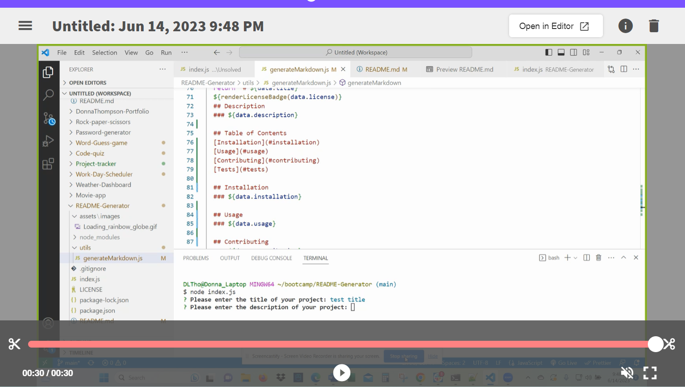

# **README Generator**

  

  ## **Description**
  README Generator allows a user to quickly create a professional README for a new project.

  ## **Table of Contents:**
  * [Installation](#installation)
  * [Usage](#usage)
  * [Credits](#credits)
  * [Contribute](#contribute)
  * [Tests](#tests)
  * [License](#license)
  * [Questions](#questions)

  ## **Installation**
  To install a public package, on the command line, run npm install <package_name> This will create the node_modulesdirectory in your current directory (if one doesnt exist yet) and will download the package to that directory. You can check to see if you already have node.js installed by running either the npm -v or the npm version command. Note:If there is no package.jsonfile in the local directory, the latest version of the package is installed.

  ## **Usage**
  When I am prompted for information about my application repository then a high-quality, professional README.md is generated with the title of my project and sections entitled Description, Table of Contents, Installation, Usage, License, Contributing, Tests, and Questions. When I enter my project title then this is displayed as the title of the README. When I enter a description, installation instructions, usage information, contribution guidelines, and test instructions then this information is added to the sections of the README entitled Description, Installation, Usage, Contributing, and Tests. When I choose a license for my application from a list of options then a badge for that license is added near the top of the README and a notice is added to the section of the README entitled License that explains which license the application is covered underWhen I enter my GitHub username then this is added to the section of the README entitled Questions, with a link to my GitHub profile. When I enter my email address then this is added to the section of the README entitled Questions, with instructions on how to reach me with additional questions. When I click on the links in the Table of Contents then I am taken to the corresponding section of the README.

  ### **Demo of how to use the README Generator:**

  ## **Credits**
  Donna Thompson, Developer. Tutorial: [Professional README Guide | The Full-Stack Blog](https://coding-boot-camp.github.io/full-stack/github/professional-readme-guide/)

  ## **Contribute**
  If you would like to contribute to this app, please follow the guidelines of The [Contributor Convenant](https://www.contributor-covenant.org/version/2/1/code_of_conduct/code_of_conduct.md). Submit contributions to the email below. 

  ## **Tests**
  Test case 1: enter all info correctly. Test Case 2: Enter most info, except leave Usage blank. Make sure app still works as expected and README file is created.

  ## **License**
Licensed under [The MIT License](https://opensource.org/licenses/MIT).

  ## **Questions**
  Please visit my GitHub profile at https://github.com/DonnaThompson7   Contact me at dlthompson7@icloud.com to report issues or if you have additional questions.
